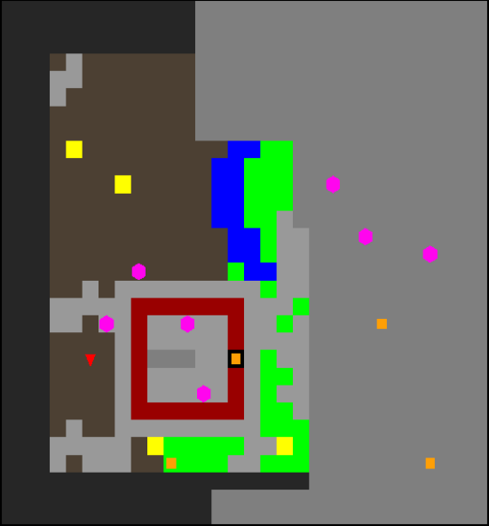
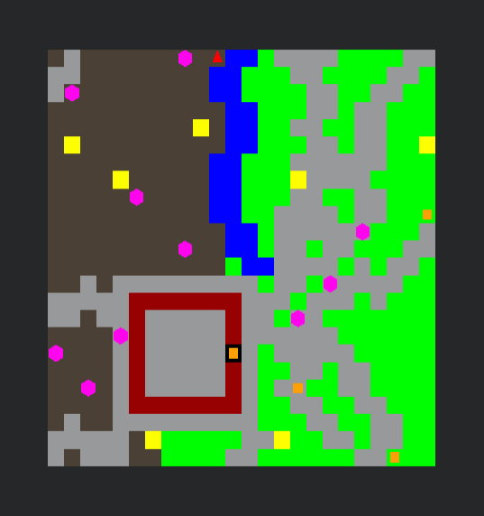
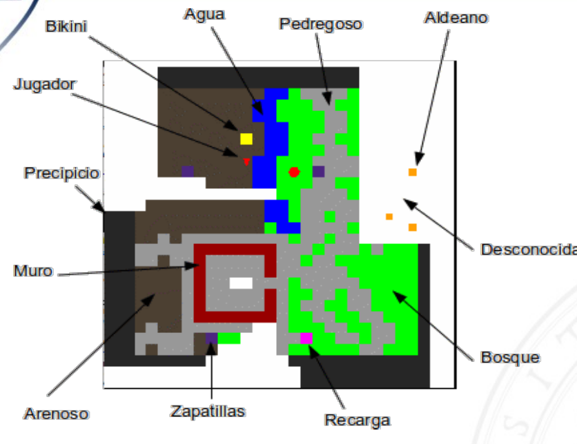
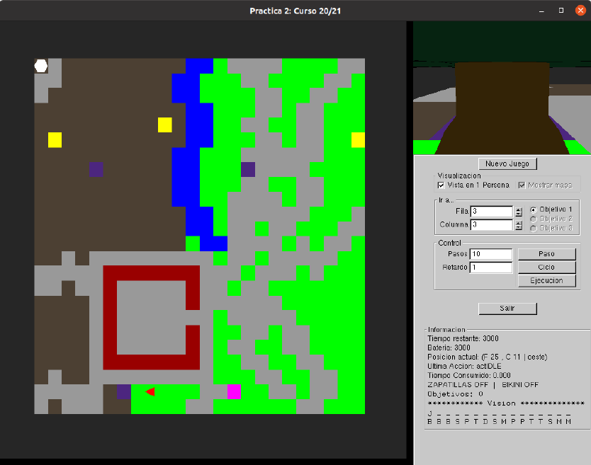

# DGIIM IA Practice 1

Practice 1 of the Inteligencia Artificial (Artificial Intelligence) course in the Double Degree in Computer Engineering and Mathematics at the University of Granada (2022-2023 academic year).

The objective of this practice is to guide a reactive agent on a 2D map with obstacles and different terrains, in order to discover as much area of the map as possible, which is initially unknown.

## How to run it

**Note**: When running `./install.sh`, it attempts to install `freeglut3`, but this package no longer exists in Debian or Ubuntu repositories, so the code cannot be executed. In Fedora, the `freeglut` package can be installed, but the code also produces errors and cannot be executed.

In Debian/Ubuntu:

* Install dependencies: `sudo apt install g++`
* Install dependencies and compile: `./install.sh`
* Compile: `make`
* Run it: `./practica1`
* Run it without GUI: `./practica1SG`

## Code developed by the student

These are the files developed by the student:

* `./Comportamientos_Jugador/jugador.cpp`
* `./Comportamientos_Jugador/jugador.hpp`
